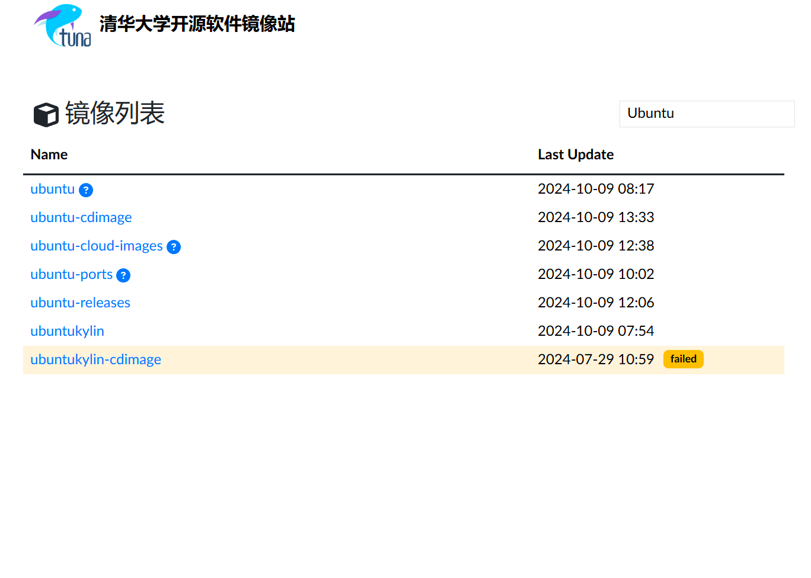
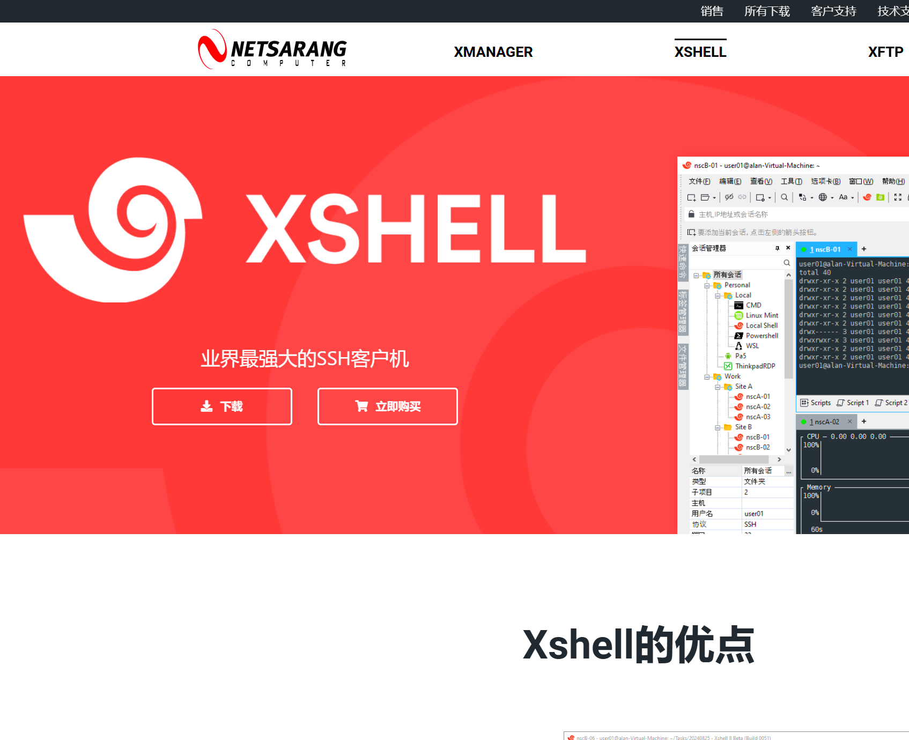
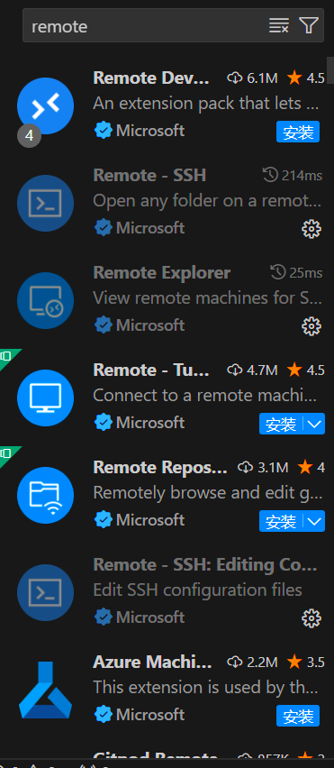
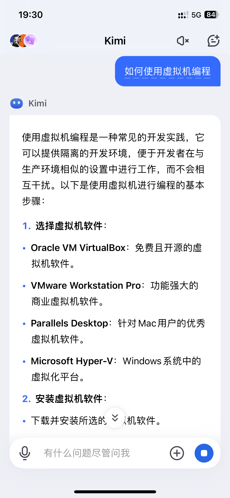

# #3 Linux & WSL&Docker

## 安装vm

## 安装ubuntu以及配置网络语言之类各种神秘小步骤

## 安装xshell，试用Linux命令

## vscode的remote插件？我来力

# 感想
## 我勒个豆好多东西要学
## AI真好用啊

#### 从一开始啥也不会到自己能够知道自己下载的是什么，能搞懂不同版本和大概弄清楚这是干嘛的还是很有成就感的。
#### 当然更有成就感的是从一开始啥都要问到能够掌握自己发现问题具体位置，上网检索相关信息以解决问题的过程。搞虚拟机的时候就好像自己是一个黑客嘿嘿。